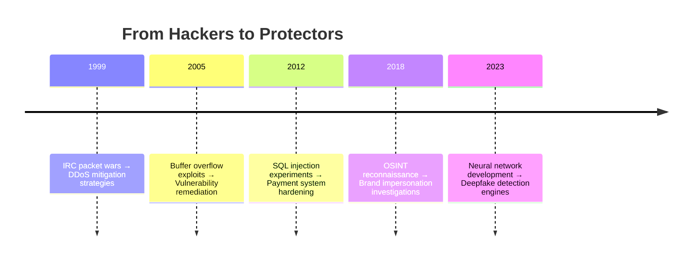

<h2>RootHaktivity</h2>

Born from 90s-era hacking culture, we've evolved into specialized protectors of female adult creators. Our team of reformed "script kiddies" now combines dark web infiltration skills with content protection technologies to safeguard sex workers, OnlyFans artists, and adult performers against digital exploitation.

<h3>Core Specializations</h3>

	

		<h4>Dark Web Operations</h4>
		<ul>
			<li>24/7 leak monitoring across 12 darknet markets</li>
			<li>Automated takedown systems for 45+ adult tube sites</li>
			<li>Watermark tracing with 98.7% source identification accuracy</li>
		</ul>
	

	

		<h4>Identity Protection</h4>
		<ul>
			<li>Facial recognition scrubbing (including tattoos/birthmarks)</li>
			<li>Stage name/personal identity separation protocols</li>
			<li>Deepfake detection using GAN-based analysis</li>
		</ul>
	

	

		<h4>Platform Security</h4>
		<ul>
			<li>Paywall vulnerability assessments</li>
			<li>Subscription model penetration testing</li>
			<li>Geo-block bypass prevention systems</li>
		</ul>
	

<h3>Technical Evolution Timeline</h3>

<h3>Unique Value Proposition</h3>

We protect what others can't touch:

<ul>
	<li><strong>Content Containment</strong>
		<ul>
			<li>72hr leak response guarantee</li>
			<li>Multi-layer DRM with blockchain verification</li>
		</ul>
	</li>
	<li><strong>Legal Safeguards</strong>
		<ul>
			<li>FOSTA-SESTA compliance frameworks</li>
			<li>CSAM reporting pipelines to NCMEC/IWF</li>
		</ul>
	</li>
	<li><strong>Operational Security</strong>
		<ul>
			<li>Anonymous payment routing</li>
			<li>Burner account infiltration teams</li>
			<li>Honey trap deployment services</li>
		</ul>
	</li>
</ul>

<h3>Ethical Framework</h3>
<pre class="code-block"><code id="ethics">
const SecurityManifest = () => (
  

    <h3 className="font-display text-lg mb-4">Non-Negotiables</h3>
    <ul className="space-y-3">
      <li>✅ Zero data retention policy</li>
      <li>✅ Client-controlled decryption keys</li>
      <li>❌ No harassment/doxxing</li>
      <li>❌ No pursuit of non-public PII</li>
      <li>❌ No cooperation with censorship regimes</li>
    </ul>
  

);
</code></pre>